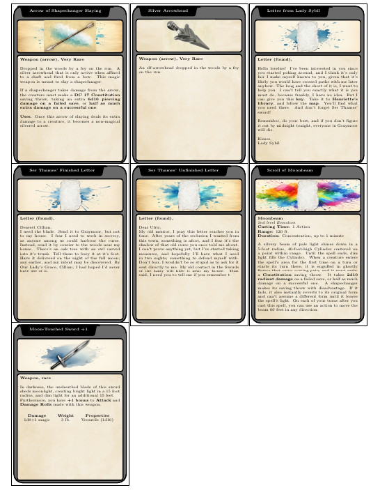

# DnD Item Card LaTeX Template

This is a LaTeX template for typesetting item cards (intended to print and cut) in the style of the fifth edition of the "world's greatest roleplaying game".

## Features

* Can create (at the moment) up to 9 cards with front and back information
* Card information is contained in their own files
* Customizable backgrounds



## Background and Credits

I was playing Moon over Graymoor with my family, and was looking a way to quickly print items that I could hand out. Many hours more than "quickly", and I had this template spun up.

This template is derived from the wonderful work of `DrailNecross` and their [D&D Item Card Template](https://www.overleaf.com/latex/templates/d-and-d-item-card-template/ndfdspmmxnrn) on Overleaf.

Which itself uses the [DnD 5e LaTeX Template](https://github.com/rpgtex/DND-5e-LaTeX-Template/).

I have kept the images included in DrailNecross' original Overleaf project, as well as added a few others. I believe they are all copyright free, but I could be mistaken. If so, let me know and I will take them down!

## Usage

To use this template, place item images in the `item_pics` folder, and card information as `tex` files in the `cards` folder.

A card file looks like the following:
```
% Arrow of Shapechanger Slaying
\renewcommand{\cardtitle}{Arrow of Shapechanger Slaying}
\renewcommand{\cardimage}{item_pics/silverArrow.png}
\renewcommand{\cardbg}{img/B1.jpg}
\renewcommand{\carddescfront}{%
\ItemTags{Weapon (arrow)}{Very Rare}{0}{n/a}
            \FlavorText{1}{Dropped in the woods by a fey on the run. A silver arrowhead that is only active when affixed to a shaft and fired from a bow. This magic weapon is meant to slay a shape\-changer.\\

            If a shape\-changer takes damage from the arrow, the creature must make a \textbf{DC 17 Constitution} saving throw, taking an extra \textbf{6d10 piercing damage on a failed save}, or \textbf{half as much extra damage on a successful one}.}
             \BonusText{1}{Uses}{Once this arrow of slaying deals its extra damage to a creature, it becomes a non-magical silvered arrow.}
}
\renewcommand{\carddescback}{%

}
```
The `cardtitle` defines the item name. `cardimage` points to the image (png with alpha looks best). `cardbg` can be used to place a background. Several are provided in the `img` folder (Thanks DrailNecross~), and the default to use would be `paper.jpg`. The final two commands --- `carddescfront` and `carddescback` are used to put item descriptions on the front and back of the card.

There are several options defined in the `itemCommands.tex` file. This allows for things like attunement, curses, and a few other predefined macros.

I have included the items for Moons Over Graymoor, including letters and a spell scroll if you are curious.


In the `dndItemCards.tex` file, an array is defined for all the cards to be included.
```
\def\cardfiles{arrowShapechangerSlaying, cardArrowHead, LetterFromLadySybil, SerThamesFinishedLetter, SerThamesUnfinishedLetter, ScrollOfMoonbeam, MoonTouchedSword}
```
To quickly generate a list, you can use
```
ls cards | grep -Po '.*(?=\.)' | paste -sd, - | xclip -selection clipboard
```ls cards | grep -Po '.*(?=\.)' | paste -sd, - | xclip -selection clipboard
to copy a comma-separated list of all files in the cards folder onto your clipboard.

Run `pdflatex` (or your preferred engine), and things should be good.

## Known issues
I thew this together somewhat quickly, so this is by no means feature-full.

* At the moment, this only works with up to 9 cards. I have not included any logic to switch to new pages after 9 cards. It is best to include 9 in a list, generate the PDF, and then run a new batch of 9.

* The spillover from the front card description to the back card description is not automatic. The user must decide where this cutoff is.

* There are some spacing issues. I'm working to fit everything in a US lettersize paper, and it just /barely/ doesn't fit. A combination of simple twiddling with margins, but perhaps better use of tikz and scaling would get proper results.

* In working to shrink the card sizes to fit 9 on a sheet, the graphics backgrounds are an odd aspect ratio, and will get stretched in some strange ways.


